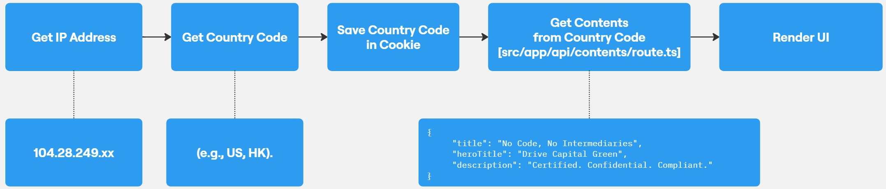

# Installation

## Prerequisites

Node.js (at least v18.12) to be installed on your system.

### Installs nvm (Node Version Manager)

```bash
curl -o- https://raw.githubusercontent.com/nvm-sh/nvm/v0.40.0/install.sh | bash
```

### Download and install Node.js (you may need to restart the terminal)

```bash
nvm install 20
```

### Install pnpm

```bash
npm install -g pnpm
```

### Get the project files

#### Option A (Using Git):

1. Install [Git](https://git-scm.com/book/en/v2/Getting-Started-Installing-Git)
2. Open a terminal and run:

```bash
git clone https://github.com/VAR-META-Tech/dcg-network-lp.git
```

#### Option B (Without Git):

1. Go to the [GitHub page](https://github.com/VAR-META-Tech/dcg-network-lp)
2. Click the green "Code" button
3. Select "Download ZIP"
4. Download and extract the ZIP file to your desired location

### Open a terminal or command prompt.

### Navigate to the project directory:

```bash
cd dcg-network-lp
```

# How to Use

### Create & use app passwords to setup SMTP

**Important**: To create an app password, you need [2-Step Verification](https://myaccount.google.com/signinoptions/twosv?gar=WzI0Nl0&rapt=AEjHL4NcKjiIPx4B0m7vToVhiyUlUnDKd1d5zYbiHLJM5Me8G0vz3ZT-b5O1UFOHowpox9TBWqgtrSm2bTOdjrp9r-Kr-i1R2bT9Hb1WHf4obT18Id01SQo) on your Google Account.

If you use 2-Step-Verification and get a "password incorrect" error when you sign in, you can try to use an app password.

[Create and manage your app passwords](https://myaccount.google.com/apppasswords). You may need to sign in to your Google Account.

### Create `.env` file

```
NODE_ENV=production

# Using http://localhost:3000 for local development or https://dcg.earth for dev/prod
NEXT_PUBLIC_APP_URL="http://localhost:3000"
# Using http://localhost:3000 for local development or https://dcg.earth for dev/prod
NEXT_PUBLIC_SANDBOX_DCG_URL=
NEXT_PUBLIC_DCG_MAIL_CC=acc1@dcg.earth,acc2@dcg.earth

BASIC_AUTH_USERNAME=user
BASIC_AUTH_PASSWORD=password
BASIC_AUTH=false

# HK or International
DEFAULT_LOCATION=HK

<!-- MAIL -->
SMTP_HOST=smtp.gmail.com
SMTP_PORT=465
SMTP_SECURE=true
SMTP_USER=info@dcg.earth
# app password just created above
SMTP_PASS=
SMTP_DEFAULT_EMAIL=info@dcg.earth
```

### Install dependencies

```bash
pnpm install
```

### Run the development server

```bash
pnpm run dev
```

# How to add locations, contents & images:

To add locations, contents & images, follow these steps:

### Navigate to the locations folder in the public folder:

1. Open your project directory.
2. Go to the `public` folder.
3. Inside the `public` folder, navigate to the `locations` folder

### Create location folders using [country codes](https://www.iplocation.net/country-codes) (2 letters):

Inside the locations folder, create folders named with the country codes (e.g., US, HK).

### Create JSON files for each component inside each page:

1. Within each location folder, create folders for each page (e.g., Home, Product, About, ...).
2. Inside each page folder, create JSON files for the components you want to add.

### Create images and videos folders inside each page folder:

1. Inside each page folder, create an images folder and a videos folder.
2. Add your image and video files to these folders.

**Example structure:**

```
locations/
  ├── location1/
  |   ├── page1/
  │   │   ├── images/
  │   │   │   ├── image1
  │   │   │   └── images2
  │   │   ├── videos/
  |   |   |   ├── video1
  │   │   │   └── video2
  |   |   ├── component1.json
  │   │   └── component2.json
  |   └── page2/
  │       ├── images/
  │       │   ├── image1
  │       │   └── images2
  │       ├── videos/
  |       |   ├── video1
  │       │   └── video2
  |       ├── component1.json
  │       └── component2.json
  └── location2/
      ├── page1/
      │   ├── images/
      │   │   ├── image1
      │   │   └── images2
      │   ├── videos/
      |   |   ├── video1
      │   │   └── video2
      |   ├── component1.json
      │   └── component2.json
      └── page2/
          ├── images/
          │   ├── image1
          │   └── images2
          ├── videos/
          |   ├── video1
          │   └── video2
          ├── component1.json
          └── component2.json
```

### UI Rendering Process Flow


